# Module Categories and Feature Flags

## Problem Statement

Current module organization requires manual imports and explicit module declarations for each host. This leads to
repetitive configuration, difficult maintenance, and potential for missing required modules or including unnecessary
ones.

## Current State Analysis

- Modules are manually imported in each host configuration
- No systematic way to group related functionality
- Host configurations contain repetitive module imports
- Difficult to understand module dependencies and relationships
- No conditional loading based on host capabilities

## Proposed Solution

Implement a capability-based module system with feature flags that automatically imports relevant modules based on
declared host capabilities and use cases.

## Implementation Details

### 1. Host Capability Declaration

Create a standardized way for hosts to declare their capabilities:

```nix
# modules/hosts/nixair/capabilities.nix
{
  hostCapabilities = {
    # Core capabilities
    platform = "nixos";
    architecture = "x86_64";
    
    # Feature flags
    features = {
      gaming = true;
      development = true;
      multimedia = true;
      server = false;
      mobile = false;
      ai = true;
    };
    
    # Hardware capabilities
    hardware = {
      gpu = "nvidia";
      audio = "pipewire";
      bluetooth = true;
      wifi = true;
      printer = true;
    };
    
    # Role-based capabilities
    roles = [
      "workstation"
      "development"
      "gaming"
    ];
    
    # Environment preferences
    environment = {
      desktop = "gnome";
      shell = "zsh";
      terminal = "alacritty";
    };
  };
}
```

### 2. Module Category Structure

Reorganize modules into logical categories:

```
modules/
├── core/              # Always imported
│   ├── base.nix
│   ├── users.nix
│   └── security.nix
├── features/          # Feature-based modules
│   ├── gaming/
│   │   ├── default.nix
│   │   ├── steam.nix
│   │   └── emulation.nix
│   ├── development/
│   │   ├── default.nix
│   │   ├── languages/
│   │   └── tools/
│   ├── multimedia/
│   │   ├── default.nix
│   │   ├── video.nix
│   │   └── audio.nix
│   └── ai/
│       ├── default.nix
│       ├── cuda.nix
│       └── models.nix
├── hardware/          # Hardware-specific
│   ├── gpu/
│   ├── audio/
│   └── networking/
├── roles/             # Role-based configurations
│   ├── workstation.nix
│   ├── server.nix
│   └── mobile.nix
└── environments/      # Desktop/shell environments
    ├── gnome/
    ├── kde/
    └── shells/
```

### 3. Capability-Based Module Loader

Create a smart module loader that imports modules based on capabilities:

```nix
# lib/capability-loader.nix
{ lib, ... }:

let
  # Map capabilities to module paths
  capabilityModules = {
    gaming = [ ../modules/features/gaming ];
    development = [ ../modules/features/development ];
    multimedia = [ ../modules/features/multimedia ];
    ai = [ ../modules/features/ai ];
  };
  
  hardwareModules = {
    nvidia = [ ../modules/hardware/gpu/nvidia.nix ];
    amd = [ ../modules/hardware/gpu/amd.nix ];
    intel = [ ../modules/hardware/gpu/intel.nix ];
    pipewire = [ ../modules/hardware/audio/pipewire.nix ];
    pulse = [ ../modules/hardware/audio/pulse.nix ];
  };
  
  roleModules = {
    workstation = [ ../modules/roles/workstation.nix ];
    server = [ ../modules/roles/server.nix ];
    mobile = [ ../modules/roles/mobile.nix ];
  };
  
  environmentModules = {
    gnome = [ ../modules/environments/gnome ];
    kde = [ ../modules/environments/kde ];
    zsh = [ ../modules/environments/shells/zsh.nix ];
    bash = [ ../modules/environments/shells/bash.nix ];
  };

in {
  # Generate module imports based on capabilities
  generateModuleImports = hostCapabilities:
    let
      # Core modules (always imported)
      coreModules = [
        ../modules/core
      ];
      
      # Feature modules based on flags
      featureModules = lib.flatten (
        lib.mapAttrsToList (feature: enabled:
          if enabled && capabilityModules ? ${feature}
          then capabilityModules.${feature}
          else []
        ) hostCapabilities.features
      );
      
      # Hardware modules
      hwModules = lib.flatten [
        (if hardwareModules ? ${hostCapabilities.hardware.gpu}
         then hardwareModules.${hostCapabilities.hardware.gpu}
         else [])
        (if hardwareModules ? ${hostCapabilities.hardware.audio}
         then hardwareModules.${hostCapabilities.hardware.audio}
         else [])
      ];
      
      # Role modules
      roleImports = lib.flatten (
        map (role: roleModules.${role} or []) hostCapabilities.roles
      );
      
      # Environment modules
      envModules = lib.flatten [
        (environmentModules.${hostCapabilities.environment.desktop} or [])
        (environmentModules.${hostCapabilities.environment.shell} or [])
      ];
      
    in coreModules ++ featureModules ++ hwModules ++ roleImports ++ envModules;
}
```

### 4. Feature Module Structure

Each feature module should be self-contained with dependencies:

```nix
# modules/features/gaming/default.nix
{ config, lib, pkgs, hostCapabilities, ... }:

{
  imports = [
    ./steam.nix
    ./emulation.nix
  ] ++ lib.optionals (hostCapabilities.hardware.gpu == "nvidia") [
    ./nvidia-optimizations.nix
  ];
  
  # Gaming-specific configuration
  programs.steam.enable = true;
  hardware.opengl.enable = true;
  
  # Gaming packages
  environment.systemPackages = with pkgs; [
    discord
    lutris
    gamemode
  ];
  
  # Performance optimizations
  boot.kernel.sysctl = {
    "vm.max_map_count" = 2147483642;
  };
}
```

### 5. Dependency Resolution System

Create a system to handle module dependencies and conflicts:

```nix
# lib/dependency-resolver.nix
{ lib, ... }:

{
  # Define module dependencies
  moduleDependencies = {
    gaming = {
      requires = [ "multimedia" ];
      conflicts = [ "minimal" ];
      suggests = [ "development" ]; # for game dev tools
    };
    
    ai = {
      requires = [ "development" ];
      conflicts = [ "minimal" ];
      hardware = [ "gpu" ]; # requires dedicated GPU
    };
    
    server = {
      conflicts = [ "gaming" "multimedia" ];
      requires = [ "security" ];
    };
  };
  
  # Resolve dependencies and detect conflicts
  resolveDependencies = requestedFeatures:
    let
      # Add required dependencies
      withDeps = requestedFeatures ++ (
        lib.flatten (map (feature:
          moduleDependencies.${feature}.requires or []
        ) requestedFeatures)
      );
      
      # Check for conflicts
      conflicts = lib.flatten (map (feature:
        lib.intersectLists 
          withDeps 
          (moduleDependencies.${feature}.conflicts or [])
      ) withDeps);
      
    in {
      features = lib.unique withDeps;
      conflicts = conflicts;
      valid = conflicts == [];
    };
}
```

### 6. Host Configuration Simplification

Simplified host configuration using capabilities:

```nix
# modules/hosts/nixair/default.nix
{ config, lib, pkgs, ... }:

let
  capabilities = import ./capabilities.nix;
  capabilityLoader = import ../../../lib/capability-loader.nix { inherit lib; };
  moduleImports = capabilityLoader.generateModuleImports capabilities.hostCapabilities;
in {
  imports = moduleImports;
  
  # Host-specific overrides
  networking.hostName = "nixair";
  
  # Capability-specific overrides
  services.xserver.enable = capabilities.hostCapabilities.environment.desktop != null;
}
```

## Files to Create/Modify

1. `lib/capability-loader.nix` - Core capability system
1. `lib/dependency-resolver.nix` - Dependency management
1. `modules/core/` - Core modules directory
1. `modules/features/` - Feature-based modules
1. `modules/hardware/` - Hardware-specific modules
1. `modules/roles/` - Role-based configurations
1. `modules/environments/` - Environment modules
1. `modules/hosts/*/capabilities.nix` - Host capability declarations
1. `flake.nix` - Updated to use capability system

## Migration Strategy

1. **Phase 1**: Create capability structure without breaking existing configs
1. **Phase 2**: Gradually migrate modules to new structure
1. **Phase 3**: Update host configurations to use capabilities
1. **Phase 4**: Remove old manual imports
1. **Phase 5**: Add dependency validation

## Testing Strategy

### Pre-Migration Analysis and Validation

Before implementing the capability system, establish baseline functionality for all hosts:

```nix
# tests/pre-migration-analysis.nix
{
  # Extract current module imports for each host
  extractCurrentModules = hostName:
    let
      hostConfig = import ../hosts/${hostName}/default.nix;
      # Recursively analyze all imports to build complete module list
      getAllImports = config: 
        config.imports ++ (lib.flatten (map getAllImports config.imports));
    in getAllImports hostConfig;
    
  # Generate baseline for each host
  generateBaseline = {
    nixair = extractCurrentModules "nixos/nixair";
    dracula = extractCurrentModules "nixos/dracula"; 
    legion = extractCurrentModules "nixos/legion";
    darwin-host = extractCurrentModules "darwin/SGRIMEE-M-4HJT";
  };
  
  # Extract current system packages for each host
  extractCurrentPackages = hostName:
    let
      builtConfig = import ../flake.nix.nixosConfigurations.${hostName}.config;
    in builtConfig.environment.systemPackages;
    
  # Extract current services for each host  
  extractCurrentServices = hostName:
    let
      builtConfig = import ../flake.nix.nixosConfigurations.${hostName}.config;
    in builtConfig.services;
}
```

### Migration Validation Tests

```nix
# tests/migration-validation.nix
{
  # Validate feature parity after migration
  testFeatureParity = hostName:
    let
      # Pre-migration state
      preModules = baseline.${hostName}.modules;
      prePackages = baseline.${hostName}.packages;
      preServices = baseline.${hostName}.services;
      
      # Post-migration state (using capabilities)
      capabilities = import ../modules/hosts/${hostName}/capabilities.nix;
      postModules = capabilityLoader.generateModuleImports capabilities.hostCapabilities;
      postConfig = buildHostConfig hostName capabilities;
      postPackages = postConfig.environment.systemPackages;
      postServices = postConfig.services;
      
    in {
      modulesMatch = lib.setEqualityCheck preModules postModules;
      packagesMatch = lib.setEqualityCheck prePackages postPackages;
      servicesMatch = lib.deepEqualityCheck preServices postServices;
      
      # Report differences
      missingModules = lib.subtractLists postModules preModules;
      extraModules = lib.subtractLists preModules postModules;
      missingPackages = lib.subtractLists postPackages prePackages;
      extraPackages = lib.subtractLists prePackages postPackages;
    };
    
  # Test all existing hosts maintain functionality
  testAllHostsParity = lib.mapAttrs (hostName: _: testFeatureParity hostName) baseline;
  
  # Validate build success for all hosts
  testBuildSuccess = lib.mapAttrs (hostName: _: 
    let
      result = tryBuildHost hostName;
    in {
      success = result.success;
      errors = result.errors or [];
    }
  ) baseline;
}
```

### Capability System Tests

```nix
# tests/capability-tests.nix
{
  # Test capability resolution
  testCapabilityResolution = {
    input = { gaming = true; development = true; };
    expectedModules = [ "gaming" "development" "multimedia" ];
  };
  
  # Test conflict detection
  testConflictDetection = {
    input = { gaming = true; server = true; };
    expectFailure = true;
    expectedConflicts = [ "gaming conflicts with server" ];
  };
  
  # Test dependency resolution
  testDependencyResolution = {
    input = { ai = true; };
    expectedModules = [ "ai" "development" ];
  };
  
  # Test backwards compatibility
  testBackwardsCompatibility = {
    # Ensure old manual imports still work during transition
    testManualImports = host: 
      let 
        oldConfig = import ../hosts/${host}/pre-migration-backup.nix;
        result = tryBuild oldConfig;
      in result.success;
  };
}
```

### Regression Prevention Tests

```nix
# tests/regression-tests.nix
{
  # Test critical functionality preservation
  testCriticalFunctionality = hostName: {
    # Ensure desktop environment still loads
    desktopWorks = testDesktopEnvironment hostName;
    
    # Ensure development tools still available
    devToolsWork = testDevelopmentTools hostName;
    
    # Ensure hardware drivers still loaded
    hardwareWorks = testHardwareFunctionality hostName;
    
    # Ensure network configuration preserved
    networkWorks = testNetworkConfiguration hostName;
    
    # Ensure user configuration preserved  
    userConfigWorks = testUserConfiguration hostName;
  };
  
  # Performance regression tests
  testPerformance = hostName: {
    buildTime = measureBuildTime hostName;
    evaluationTime = measureEvaluationTime hostName;
    memoryUsage = measureMemoryUsage hostName;
  };
  
  # Test configuration equivalence
  testConfigEquivalence = hostName:
    let
      preConfig = baseline.${hostName}.finalConfig;
      postConfig = buildConfigWithCapabilities hostName;
    in deepConfigComparison preConfig postConfig;
}
```

## Benefits

- Simplified host configuration
- Automatic dependency resolution
- Conflict detection
- Better module organization
- Easier maintenance and updates
- Self-documenting capabilities
- Reduced configuration errors

## Implementation Steps

1. **Pre-Migration Analysis**

   1. Run baseline extraction for all existing hosts
   1. Document current module imports, packages, and services per host
   1. Create configuration snapshots for rollback capability
   1. Establish performance benchmarks (build time, evaluation time)

1. **Design Phase**

   1. Design capability schema and module categories
   1. Map existing modules to new capability structure
   1. Create capability declarations that match current host functionality

1. **Foundation Building**

   1. Create capability loader and dependency resolver
   1. Reorganize existing modules into new structure (preserving all functionality)
   1. Add comprehensive tests for capability resolution

1. **Migration Phase**

   1. Create capability declarations for existing hosts (matching baseline)
   1. Update flake.nix to use capability system with fallback support
   1. Migrate hosts one by one with validation at each step
   1. Run feature parity tests after each host migration

1. **Validation and Cleanup**

   1. Run full regression test suite
   1. Validate all hosts build successfully
   1. Compare post-migration configuration against baseline
   1. Remove old manual imports only after validation passes
   1. Update documentation

1. **Performance Validation**

   1. Compare build and evaluation performance against baseline
   1. Ensure no performance regressions introduced

## Acceptance Criteria

### Functionality Preservation

- [ ] **Pre-migration baseline established** - Complete inventory of modules, packages, and services per host
- [ ] **100% feature parity maintained** - All hosts have identical functionality after migration
- [ ] **No missing modules** - All previously imported modules are still included via capabilities
- [ ] **No missing packages** - All system packages remain available after migration
- [ ] **No missing services** - All enabled services remain active after migration
- [ ] **Configuration equivalence verified** - Deep comparison confirms identical final configuration

### Capability System Functionality

- [ ] Host configurations use capability declarations
- [ ] Modules are automatically imported based on capabilities
- [ ] Dependency resolution works correctly
- [ ] Conflict detection prevents invalid configurations
- [ ] New hosts can be created with minimal configuration
- [ ] Tests validate capability system behavior

### Build and Performance Validation

- [ ] **All existing hosts build successfully** - No build failures introduced
- [ ] **Build time regression < 10%** - Performance maintained or improved
- [ ] **Evaluation time regression < 10%** - Flake evaluation performance maintained
- [ ] **Memory usage stable** - No significant memory usage increases

### Testing and Quality Assurance

- [ ] **Baseline tests pass** - Pre-migration functionality verified
- [ ] **Migration tests pass** - Feature parity validation successful
- [ ] **Regression tests pass** - Critical functionality preserved
- [ ] **Capability tests pass** - New system behavior validated
- [ ] **Integration tests pass** - End-to-end functionality verified

### Documentation and Maintenance

- [ ] Documentation explains capability system
- [ ] Migration rollback procedures documented
- [ ] Troubleshooting guide created for capability issues

## Module Import Structure Analysis

The following mermaid diagram illustrates the current module import structure and relationships:

```mermaid
graph TD
    %% Main Entry Point
    flake[flake.nix<br/>Main Entry Point]
    
    %% Capability System
    capInt[lib/capability-integration.nix<br/>Capability System]
    capLoader[lib/capability-loader.nix]
    capSchema[lib/capability-schema.nix]
    depResolver[lib/dependency-resolver.nix]
    
    %% Platform Configurations
    nixosConf[nixosConfigurations]
    darwinConf[darwinConfigurations]
    
    %% Host Discovery
    hostDiscovery[Dynamic Host Discovery<br/>hosts/ directory scanning]
    
    %% Hosts
    subgraph "NixOS Hosts"
        nixair[nixair]
        dracula[dracula]
        legion[legion]
    end
    
    subgraph "Darwin Hosts"
        macHost[SGRIMEE-M-4HJT]
    end
    
    %% Platform Modules
    subgraph "Darwin Modules"
        darwinDefault[modules/darwin/default.nix]
        darwinDock[dock.nix]
        darwinHomebrew[homebrew/]
        darwinFinder[finder.nix]
        darwinSystem[system.nix]
        darwinFonts[fonts.nix]
        darwinKeyboard[keyboard.nix]
        darwinNix[nix.nix]
        darwinOther[... 10 more modules]
    end
    
    subgraph "NixOS Modules"
        nixosDefault[modules/nixos/default.nix]
        nixosDisplay[display.nix]
        nixosSound[sound.nix]
        nixosHardware[hardware.nix]
        nixosSway[sway.nix]
        nixosNetworking[networking.nix]
        nixosNix[nix.nix]
        nixosOther[... 20 more modules]
    end
    
    %% Home Manager
    subgraph "Home Manager"
        hmDefault[modules/home-manager/default.nix]
        hmUser[user/default.nix]
        hmPrograms[user/programs/]
        hmDotfiles[user/dotfiles/]
        hmPackages[user/packages.nix]
        hmSops[user/sops.nix]
    end
    
    %% External Inputs
    subgraph "External Inputs"
        nixpkgs[nixpkgs stable/unstable]
        homeManager[home-manager]
        nixDarwin[nix-darwin]
        nixosHw[nixos-hardware]
        sopsNix[sops-nix]
        macAppUtil[mac-app-util]
    end
    
    %% Overlays and Utils
    overlays[overlays/]
    secrets[secrets/]
    utils[utils/]
    
    %% Main Flow
    flake --> capInt
    flake --> hostDiscovery
    flake --> nixosConf
    flake --> darwinConf
    
    %% Capability System
    capInt --> capLoader
    capInt --> capSchema
    capInt --> depResolver
    
    %% Host Discovery
    hostDiscovery --> nixair
    hostDiscovery --> dracula
    hostDiscovery --> legion
    hostDiscovery --> macHost
    
    %% Platform Routing
    nixosConf --> nixair
    nixosConf --> dracula
    nixosConf --> legion
    darwinConf --> macHost
    
    %% Host to Module Imports
    nixair --> nixosDefault
    dracula --> nixosDefault
    legion --> nixosDefault
    macHost --> darwinDefault
    
    %% Module Dependencies
    darwinDefault --> darwinDock
    darwinDefault --> darwinHomebrew
    darwinDefault --> darwinFinder
    darwinDefault --> darwinSystem
    darwinDefault --> darwinFonts
    darwinDefault --> darwinKeyboard
    darwinDefault --> darwinNix
    darwinDefault --> darwinOther
    
    nixosDefault --> nixosDisplay
    nixosDefault --> nixosSound
    nixosDefault --> nixosHardware
    nixosDefault --> nixosSway
    nixosDefault --> nixosNetworking
    nixosDefault --> nixosNix
    nixosDefault --> nixosOther
    
    %% Home Manager Integration
    nixair --> hmDefault
    dracula --> hmDefault
    legion --> hmDefault
    macHost --> hmDefault
    
    hmDefault --> hmUser
    hmUser --> hmPrograms
    hmUser --> hmDotfiles
    hmUser --> hmPackages
    hmUser --> hmSops
    
    %% External Dependencies
    flake --> nixpkgs
    flake --> homeManager
    flake --> nixDarwin
    flake --> nixosHw
    flake --> sopsNix
    flake --> macAppUtil
    
    %% Additional Resources
    flake --> overlays
    flake --> secrets
    flake --> utils
    
    %% Styling
    classDef flakeNode fill:#e1f5fe,stroke:#01579b,stroke-width:3px
    classDef hostNode fill:#f3e5f5,stroke:#4a148c,stroke-width:2px
    classDef moduleNode fill:#e8f5e8,stroke:#1b5e20,stroke-width:2px
    classDef externalNode fill:#fff3e0,stroke:#e65100,stroke-width:2px
    classDef capabilityNode fill:#fce4ec,stroke:#880e4f,stroke-width:2px
    
    class flake flakeNode
    class nixair,dracula,legion,macHost hostNode
    class darwinDefault,nixosDefault,hmDefault,darwinDock,darwinHomebrew,nixosDisplay,nixosSound,hmUser moduleNode
    class nixpkgs,homeManager,nixDarwin,nixosHw,sopsNix,macAppUtil externalNode
    class capInt,capLoader,capSchema,depResolver capabilityNode
```



### Current Architecture Analysis

**1. Dynamic Host Discovery**: The flake automatically discovers hosts from the `hosts/` directory structure, supporting both NixOS and Darwin platforms.

**2. Capability System**: A sophisticated capability-based configuration system that can fall back to traditional imports for backward compatibility.

**3. Platform Separation**: 
- **Darwin modules**: macOS-specific (dock, homebrew, finder, etc.)
- **NixOS modules**: Linux-specific (display, sound, hardware, sway, etc.)
- **Home Manager**: User-space configuration shared across platforms

**4. Modular Design**: Each platform has a `default.nix` that imports all relevant modules, making it easy to enable/disable features per host.

**5. External Integration**: Clean integration with external flake inputs like nixpkgs, home-manager, nix-darwin, and specialized tools.

This diagram shows how the unified flake structure dynamically discovers hosts and routes them through platform-specific module hierarchies, with the capability system providing advanced configuration management while maintaining backward compatibility.
