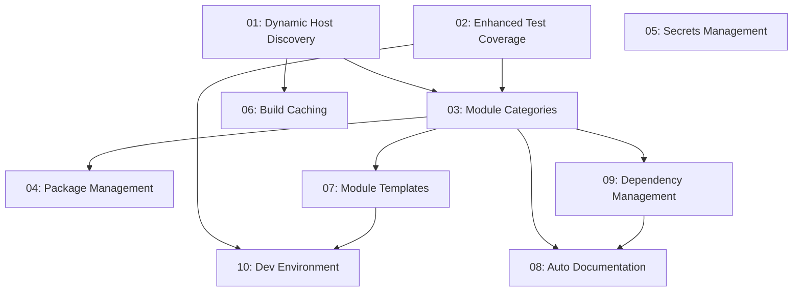

# Nix-Unified Specifications

This directory contains all specifications for features, architecture decisions, and implementation plans for the
nix-unified configuration repository.

## Overview

Each specification follows a consistent format with status tracking, priority levels, and dependency management. The
numbering scheme preserves implementation order and allows for future additions.

## Status Definitions

- **implemented**: Feature has been fully implemented and is active
- **in-progress**: Currently being implemented
- **plan**: Specification ready for implementation but not started

## Priority Levels

- **high**: Critical features that significantly impact functionality
- **medium**: Important features that improve system quality
- **low**: Nice-to-have features for future enhancement

## Categories

- **architecture**: Core system design and organization
- **development**: Developer tools and workflows
- **infrastructure**: Build, performance, and CI/CD
- **security**: Security, secrets management, and access control
- **documentation**: Documentation and knowledge management

## Specifications Index

### Implemented Features ✅

| Spec                                              | Title                                                          | Priority | Category     | Implementation Date |
| ------------------------------------------------- | -------------------------------------------------------------- | -------- | ------------ | ------------------- |
| [01](01-dynamic-host-discovery-implementation.md) | Dynamic Host Discovery with Directory-Based Platform Detection | High     | Architecture | 2025-01-30          |
| [02](02-enhanced-test-coverage-implementation.md) | Enhanced Test Coverage and CI Matrix Strategy                  | High     | Development  | 2025-01-30          |
| [03](03-module-categories-feature-flags.md)       | Module Categories and Feature Flags                            | High     | Architecture | 2025-01-30          |
| [04](04-centralized-package-management.md)        | Centralized Package Management System                          | Medium   | Architecture | 2025-01-30          |
| [09](09-module-dependency-management.md)          | Self-Sufficient Modules and Simple Conflict Detection          | Medium   | Architecture | 2025-09-15          |
| [11](11-auto-category-mapping-ham.md)             | Auto Category Mapping & Ham Capability                         | Medium   | Architecture | 2025-09-10          |

### Planned Features 📋

| Spec                                             | Title                                                     | Priority | Category       | Dependencies |
| ------------------------------------------------ | --------------------------------------------------------- | -------- | -------------- | ------------ |
| [05](05-enhanced-secrets-management.md)          | Enhanced Secrets Management with Categorical Organization | High     | Security       | -            |
| [06](06-build-caching-performance.md)            | Build Caching and Performance Optimization                | Medium   | Infrastructure | 01           |
| [07](07-module-templates-generation.md)          | Module Templates and Code Generation                      | Medium   | Development    | 03           |
| [05](05-enhanced-secrets-management.md)          | Enhanced Secrets Management with Categorical Organization | High     | Security       | -            |
| [06](06-build-caching-performance.md)            | Build Caching and Performance Optimization                | Medium   | Infrastructure | 01           |
| [07](07-module-templates-generation.md)          | Module Templates and Code Generation                      | Medium   | Development    | 03           |
| [08](08-auto-generated-documentation.md)         | Enhanced Documentation with Auto-Generation               | Low      | Documentation  | 03, 09       |
| [10](10-development-environment-improvements.md) | Development Environment Improvements                      | Medium   | Development    | 02, 07       |

## Implementation Roadmap

### Phase 1: Core Architecture (High Priority) ✅ COMPLETE

Foundational changes that affect how the system works:

1. **[01] Dynamic Host Discovery** ✅ - Automatic host discovery and platform detection
1. **[02] Enhanced Test Coverage** ✅ - Comprehensive testing framework
1. **[03] Module Categories and Feature Flags** ✅ - Capability-based configuration system
1. **[04] Centralized Package Management** ✅ - Unified package organization and management

### Phase 2: Remaining High Priority Features

Critical features for system reliability and security:

5. **[05] Enhanced Secrets Management** - Secure sensitive configuration

### Phase 3: System Enhancement (Medium Priority)

Improvements to build performance and development experience:

6. **[06] Build Caching and Performance** - Optimize build times and resource usage
1. **[07] Module Templates and Code Generation** - Streamline development workflow
1. **[10] Development Environment Improvements** - Enhanced debugging and tooling

### Phase 4: Documentation and Polish (Low Priority)

Quality of life improvements:

9. **[08] Enhanced Documentation with Auto-Generation** - Maintain up-to-date documentation

## Dependencies



## Quick Reference

### Status Overview

- ✅ **Implemented**: 6 specifications (55%)
- 📋 **Planned**: 5 specifications (45%)
- 🚧 **In Progress**: 0 specifications (0%)

### Priority Breakdown

- **High Priority**: 4 specifications (40%)
- **Medium Priority**: 5 specifications (50%)
- **Low Priority**: 1 specification (10%)

### Category Distribution

- **Architecture**: 5 specifications
- **Development**: 3 specifications
- **Infrastructure**: 1 specification
- **Security**: 1 specification
- **Documentation**: 1 specification

## Contributing

When adding new specifications:

1. **Number sequentially**: Continue from 11, 12, etc.
1. **Include metadata header**: Use the consistent YAML frontmatter format
1. **Follow template structure**: Problem statement, solution, implementation details, acceptance criteria
1. **Update this README**: Add entry to appropriate section and update statistics
1. **Consider dependencies**: Note which specifications should be implemented first

### Specification Template

```yaml
---
title: [Descriptive Title]
status: [plan|in-progress|implemented]
priority: [high|medium|low]
category: [architecture|development|infrastructure|security|documentation]
implementation_date: [YYYY-MM-DD or null]
dependencies: [list of spec numbers]
---

# [Title]

## Problem Statement
[Describe the current problem or limitation]

## Proposed Solution
[High-level description of the solution]

## Implementation Details
[Detailed technical implementation]

## Benefits
[Expected benefits and improvements]

## Acceptance Criteria
[Specific criteria for completion]
```

## History

This directory was consolidated from the original `PRP/` and `docs/` folders to create a unified specification system
with proper status tracking and dependency management. The consolidation eliminated overlapping documentation and
established clear implementation priorities.

**Original Sources Merged:**

- PRP/01-10 specifications → specs/01-10 with status headers
- docs/hosts.md + docs/migration-guide.md + docs/migration-plan.md → merged into
  01-dynamic-host-discovery-implementation.md
- docs/testing.md → merged into 02-enhanced-test-coverage-implementation.md

This unified approach provides better organization, eliminates duplication, and creates a clear roadmap for future
development.
